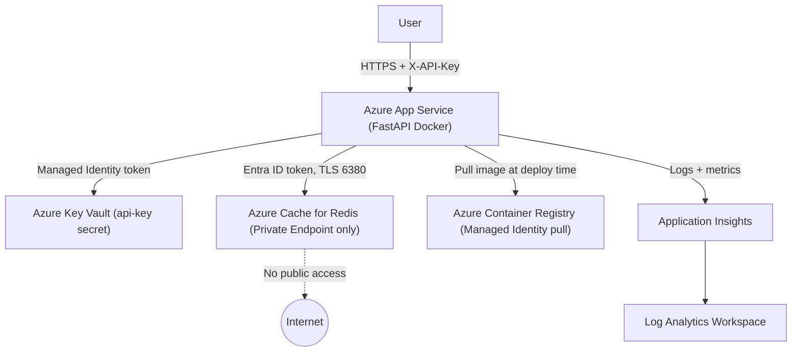

# Architecture

## Diagram

## Component Overview

| Component | SKU | Purpose |
|-----------|-----|---------|
| Azure App Service | B2 Linux | Hosts the FastAPI Docker container |
| Azure Cache for Redis | Basic C1 | URL storage, click counting, rate-limit buckets |
| Azure Key Vault | Standard | Stores the `api-key` secret |
| Azure Container Registry | Basic | Stores the Docker image |
| Application Insights + Log Analytics | PerGB2018 | Observability, alerting |
| Virtual Network | — | Network isolation for Redis private endpoint and App Service VNet integration |

## Data Flow

1. **Request arrives** at App Service over HTTPS — plaintext HTTP is rejected (HTTPS-only enforcement).
2. **IP restriction** is evaluated by App Service: only the configured owner IP(s) and Azure's health check probe (`168.63.129.16/32`) are allowed. All other traffic receives 403.
3. **Rate limit middleware** runs: increments a Redis counter keyed by `ratelimit:{api_key}:{minute}`. If the count exceeds 60, the request is rejected with 429.
4. **API key validation**: the `X-API-Key` header is compared against the in-memory-cached API key originally fetched from Key Vault at startup. Invalid keys receive 401.
5. **Redis lookup**: the router queries Redis for the URL or metadata using the short code.
6. **Response**: redirect (302), JSON payload, or appropriate error code.

## Auth Flow: API Key

1. App Service starts → `startup()` hook calls `auth_service.load_api_key()`.
2. `DefaultAzureCredential` obtains an Entra ID token using the App Service **system-assigned managed identity**.
3. `SecretClient` fetches the `api-key` secret from Key Vault — the managed identity has the `Key Vault Secrets User` RBAC role.
4. The key is cached in memory for the lifetime of the process.

## Auth Flow: Redis

1. `redis_service.connect()` calls `DefaultAzureCredential.get_token("https://redis.azure.com/.default")`.
2. The Entra ID token is used as the Redis password — no static password is ever stored.
3. The managed identity has the `Redis Data Owner` role on the Redis resource, granting data-plane access.
4. A background task refreshes the token every 20 hours (tokens expire in ~24 hours).

## Network Isolation

- **Redis** has `public_network_access_enabled = false` — it is reachable only via its private endpoint in `redis-subnet` (`10.0.2.0/24`).
- **App Service outbound** traffic is routed through VNet Integration (`app-subnet`, `10.0.1.0/24`) with `WEBSITE_VNET_ROUTE_ALL=1`, ensuring all egress (including Redis and Key Vault calls) flows through the VNet.
- **NSG on `redis-subnet`**: allows TCP 6380 only from `10.0.1.0/24`; denies everything else inbound.
- **Private DNS Zone** `privatelink.redis.cache.windows.net` is linked to the VNet so the Redis hostname resolves to its private IP (`10.0.2.x`) inside the VNet.
